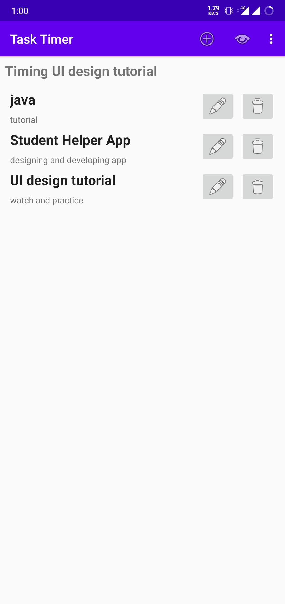
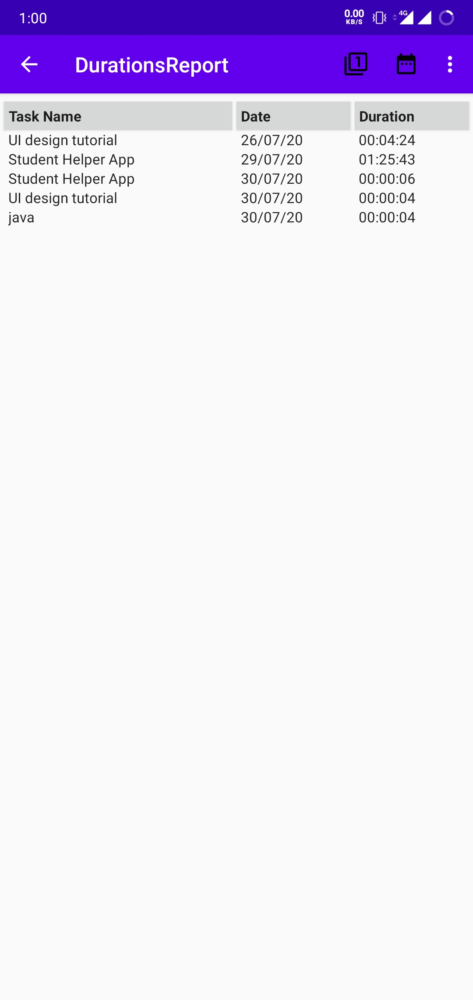
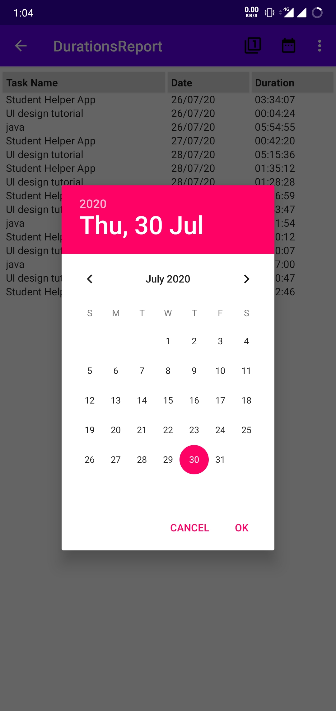
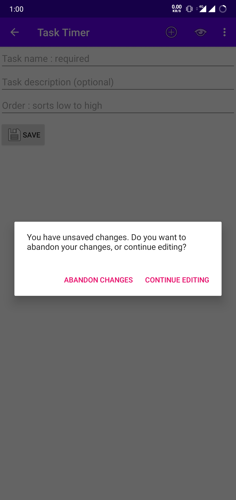

# Task_Timer_App

Task Timer Android App

This app can be used for managing and timing our tasks.

Long Press on any task will start timing that task.

We can analyse our tasks daily, weekly and by date. It will show how much time we spend to do differnt tasks.

          

Add and Edit old tasks.

